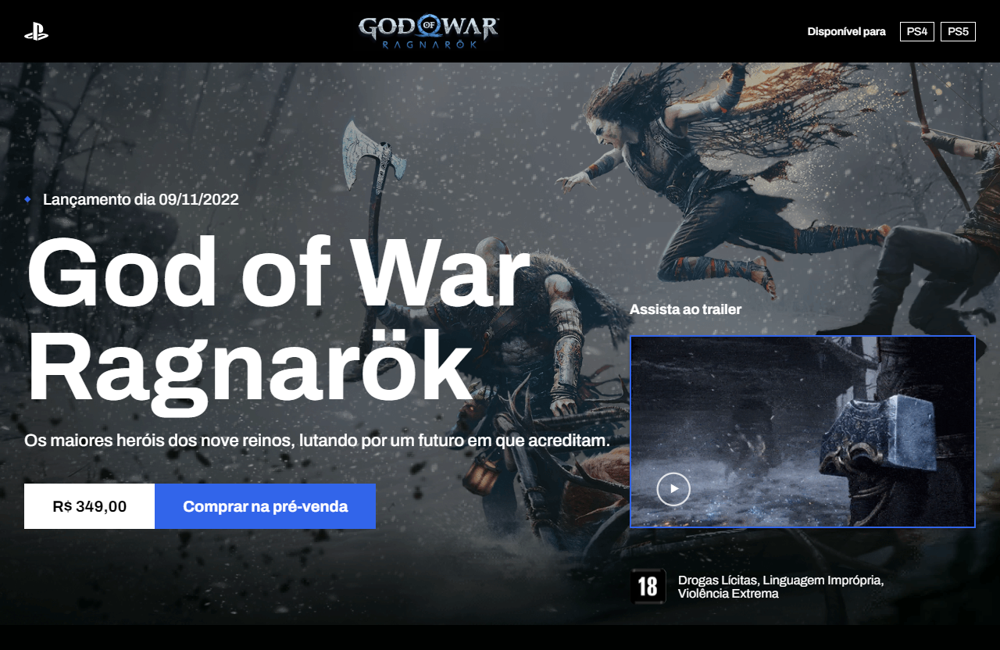

# Projeto God of War

Olá, pessoal!

Gostaria de compartilhar com vocês o projeto desenvolvido durante o evento DevProcess, conduzido pelo professor William Moreira (Codeboost). Trata-se de uma landing page com informações sobre o jogo God of War.

Foi utilizada principalmente a propriedade CSS flexbox para organizar o conteúdo na página. Também foi implementado JavaScript para criar o slide dos personagens e adicionar alguns efeitos às seções conforme o usuário faz scroll. A interface é responsiva, então você pode visualizá-la perfeitamente em um desktop, tablet ou dispositivo móvel.

Espero que gostem! Eu amei! 😊

## Tecnologias Utilizadas
- HTML
- CSS
- SASS
- JavaScript

## Dê play no projeto!

[Confira aqui!](https://iana-ribeiro.github.io/godofwar/)

## Contato

**E-mail**: ianaribeiro.tech@gmail.com

Ou entre em contato pelo [LinkedIn](https://www.linkedin.com/in/iana-ribeiro/).
